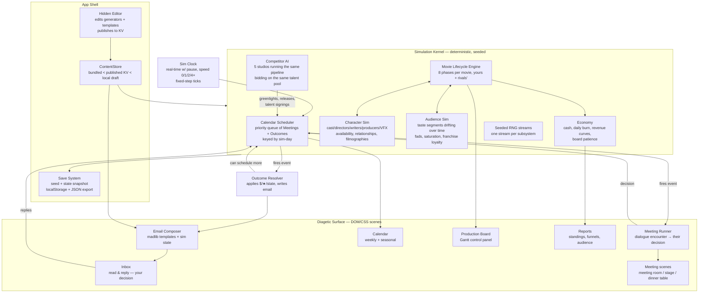

# Box Office Boss — Design Document

*Compiled 2026-08-10 from Sean's notebook (8/10/26) + interview. This doc is the execution
contract for a Claude → GitHub → Cloudflare → Player/Editor project mirroring the PlayPen
architecture.*

---

## 0. Locked Decisions

| Decision | Choice |
|---|---|
| Fail states | Bankruptcy (cash ≤ 0) **and** board firing via **escalating patience** (no visible meter — read it from the board's tone) |
| Long-term goal | Survive, climb the box office standings, build franchises |
| Time model | **Real-time with pause**, adjustable speed; calendar events pause it |
| Pace | **Slow burn** — movies feel like projects; 10+ hour careers with saves |
| Tone | **Satirical Hollywood comedy** (The Studio energy), **PG-13 sharp** — ego, incompetence, absurd showbiz logic; innuendo fine, no profanity |
| Rendering | **DOM/CSS scenes** — layered CSS/SVG backdrops, styled DOM for emails/calendar/reports, procedural SVG character portraits. No image/audio assets (PlayPen rule) |
| Competitors | **Full parallel sim** — rival studios run the same movie lifecycle from the same talent pool |
| Content | **Fully procedural** — the editor edits *generators* (trait tables, name banks, templates), not instances |
| Dialogue/emails | **Pure templates, no runtime AI** — madlib banks filled from sim state; deterministic and free |
| Persistence | **Seeded sim + localStorage + JSON export/import**; PlayPen determinism rules (simNow, seeded RNG) from day one |
| Stack | **PlayPen mirror**: Vite + TS, all design data in `content/` JSON, hidden in-app editor, Cloudflare Pages + KV published content with 3-way merge, telemetry/reports KV, optional Electron shell |

---

## 1. Inspirations — What Each Brings and How They Synthesize

### The Studio (show)
**Discrete elements:** Every scene is a *meeting* — the drama lives in conversations where
someone wants something from you. Continuity of ego: talent remembers slights. The comedy of
being nominally in charge but actually hostage to everyone's vanity. Crises always arrive at
the worst moment and compound.

**What we take:** Meetings as *dialogue encounters where the outcome is their decision* — you
choose what to say, they choose what happens. Persistent character memory (a passed-over
director shows up frostier next time). Setbacks that cascade.

### Papers, Please
**Discrete elements:** A single desk as the whole world. A daily rhythm with hard structure.
Reading dense documents *is* the gameplay — cross-referencing is the skill. Moral/financial
pressure escalates through paperwork, not cutscenes. The diagetic interface carries all
narrative.

**What we take:** The desk-bound, document-driven core: emails, contracts, reports, calendars
are the game surface. Skill = reading a pitch memo against the audience report against the
budget and spotting the mismatch. Pressure through paperwork tone (the board's emails get
shorter and colder as patience wears).

### Fantasy Box Office (Sean's own project)
**Discrete elements:** Profit-as-score: **points = revenue-to-date − total budget** — one
brutally legible number. Weekly standings cadence with line-chart histories. Auction scarcity:
everyone drafts from the same movie pool. The Monday recap as a ritual artifact.

**What we take:** The standings model wholesale (§10.1): weekly-snapshot profit lines, you vs.
competitors, the same `computeStandings`/`computeHistory` shape. Talent scarcity replaces
movie scarcity — rivals bid on the same actors and directors you want. The weekly trade-press
email is our Monday recap.

### Game Dev Tycoon
**Discrete elements:** The product pipeline as the core loop: concept → build phases → launch
→ reviews → sales curve → reinvest. Sliders/choices whose effects you learn by shipping.
Time-as-currency with parallel projects. The review-score reveal as the dopamine moment.

**What we take:** The movie lifecycle (§4) as a legible pipeline with phase-gated decisions.
Learning the sim by shipping (audience tastes are discoverable, not printed). Overlapping
productions on a Gantt board. The opening-weekend reveal as the big payoff beat.

### Synthesis
Papers, Please supplies the *surface* (desk, documents, daily rhythm). Game Dev Tycoon
supplies the *spine* (the pipeline and its economy). Fantasy Box Office supplies the
*scoreboard* (profit standings vs. simulated rivals over time). The Studio supplies the
*people* (meetings, egos, memory, escalating farce). The player is a studio head who reads
paperwork at a desk, makes pipeline decisions in meetings, and watches the consequences graph
themselves — while five simulated rivals do the same thing to the same talent pool in real
time.

---

## 2. Core Loop & User Journey

### 2.1 The loop, one sentence
Read email → take meetings → decisions schedule outcomes on the calendar → outcomes arrive
as email → repeat, while the clock runs and rivals move.

### 2.2 A day in the life (mid-career player, ~15 real minutes)

1. **Morning, Office scene.** Clock running at 1× (1 in-game day ≈ 45 real seconds at
   default speed; pause is free and expected). Inbox badge shows 4.
2. **Email 1 — Production Setback:** *"Lightning Rod II: cast injury. Blaze Cannon threw his
   back out doing his own stunts (against everyone's advice, including his chiropractor's)."*
   Reply options: expand budget +$2.1M for a delay + stunt double, or cancel the project
   (eat sunk cost). Player expands. → Outcome auto-scheduled: production end date slides 2
   weeks on the Gantt; the release date it was chasing is now at risk.
3. **Email 2 — Movie Pitch** from writer Tabitha Quill: haunted-submarine thriller. Reply:
   schedule Pitch Meeting (books next open Tuesday slot) or ignore.
4. **Email 3 — News Report:** rival studio Pinnacle greenlit a submarine action movie.
   Hmm. Player checks the **Audience Report** — submarine interest is a spiking fad. Race, or
   counter-program?
5. **Calendar chime — Casting Interview** (meeting room scene). Actress Marlowe Vex, wanted
   for the lead in *Dread Depth*. She wants $80k/day and a "no early mornings" rider. Player
   flatters her filmography and offers $65k + top billing. **She decides:** accepts, but her
   cooperation stat notes the lowball. Outcome scheduled: cast locked at pre-production start.
6. **Player opens the Production Board** (wall Gantt). Three movies in flight; drags
   *Dread Depth*'s release off the same weekend Pinnacle's sub movie is tracking toward.
7. **Evening — Awards Ceremony** on the calendar (dinner-table scene). *Lightning Rod*
   is up for Best Stunt Ensemble. It loses. Blaze Cannon, at the table, in a neck brace,
   takes it personally. Relationship −. Player picks a toast line to salvage the night.
8. **Week rolls over:** Box Office Standings email lands — the weekly line-chart snapshot,
   you vs. five rivals, profit = revenue-to-date − total budget. You've slipped to 4th. The
   board's standup invite for Friday has a one-line agenda: *"Trajectory."*

### 2.3 Service map



**The one rule (inherited from PlayPen):** the kernel is code; every *number, name bank,
template, trait table, and scenario* lives in `content/` JSON and is editor-editable.

### 2.4 Calendar mechanics (the backbone)

- Two event types only: **Meetings** (dialogue encounters — outcome is *their* decision) and
  **Outcomes** (moments where prior decisions take effect — reported via email).
- Decisions and outcomes can schedule more meetings and outcomes. Some outcomes randomly
  schedule themselves (setbacks, fads, rival moves) — always drawn from seeded RNG so a
  save's future is reproducible.
- Annual timeline divided into **4 seasons** (Winter/Spring/Summer/Awards-Fall), each with an
  audience-behavior modifier (summer = big-opening appetite; fall = critic-weight up;
  winter dump-months = cheap counter-programming). Release-date strategy is a core skill.
- The week is the reporting cadence (standings email every Monday); the day is the sim step;
  meetings occupy morning/afternoon/evening slots — a full slate means a pitch has to wait,
  and waiting has a cost (talent gets signed elsewhere; fads decay).
- Time speed: pause / 1× / 2× / 4×. Any calendar event auto-pauses. Empty stretches are
  fast-forwardable but never skipped — the clock IS the pressure.

---

## 3. Fail States & the Board

- **Bankruptcy:** cash ≤ 0 at any daily settlement → game over (a short, brutal
  final board email; the studio logo comes off the wall in the office scene).
- **Escalating patience:** no visible meter. Internally, `boardPatience` moves on quarterly
  profit vs. an escalating expectation curve, flops, scandals, and awards. Its value leaks
  out *diagetically only*:
  - Email tone tier (warm → curt → cold → hostile) selected by patience band.
  - Executive Standup frequency (quarterly → monthly → weekly as patience drops).
  - Meeting scene staging (board members' postures/expressions, who bothers to attend).
  - At the lowest band, a "Final Quarter" standup states the terms plainly — the one moment
    the game says the quiet part out loud, so the firing is never a surprise from nowhere.
- Firing plays as a dialogue encounter you cannot win but can *style out* (exit-line choice
  becomes the run's epitaph on the game-over screen).

---

## 4. Movie Lifecycle (the spine)

Each movie — yours or a rival's — walks the same 8-phase state machine. Every phase
transition is a scheduled **Outcome**; every decision point inside a phase is an **email
reply** or a **meeting**.

```
1 Pitch → 2 Script → 3 Pre-Production → 4 Production → 5 Post-Production
      → 6 Release → 7 Distribute (home video) → 8 Sequel? → (new Pitch)
```

| Phase | Data on its card | Player decisions | Cost model |
|---|---|---|---|
| **1. Pitch** | Genre & subgenre, title, estimated maturity rating, ideal starring cast?, ideal director?, established franchise? / sequel-of?, writer | Take the pitch meeting; greenlight to script or pass | Cost to greenlight → script |
| **2. Script** | Director attached, ideal cast, written-by, target length, minimum budget, estimated VFX count | Approve/redraft (redraft = time + writer mood); greenlight to pre-pro | Cost to greenlight |
| **3. Pre-Production** | Cast locked in (casting interviews), production timeline, actual budget, producers attached | Casting offers, producer pick, timeline/budget approval | Cost to greenlight → production |
| **4. Production** | Scene schedule with cast requirements (shot list), daily production cost, film locations | Respond to setbacks; production reviews | Daily burn × timeline |
| **5. Post-Production** | Actual VFX shot count, VFX studio(s) selection, daily cost, reshoots w/ cast, screening review results, marketing → **Hype** | VFX studio choice (cost vs. quality vs. throughput), order reshoots?, marketing spend | Daily burn + marketing + VFX contracts |
| **6. Release** | Theater count, viewer interest count, opening weekend, marketing, actual runtime, reviews (critics + fans), tickets sold, revenue | Pick release date/season, theater push | Revenue begins; weekly decay curve |
| **7. Distribute** | Retailer orders, viewer interest count, actual home-video sales | Price point, timing | Long-tail revenue |
| **8. Sequel?** | Auto-generated pitch if the audience sim says the franchise has legs | Take it or leave it | Franchise value carries |

**Quality model (hidden, discoverable):** each movie accumulates a quality vector from
writer skill × genre fit, director/cast fit, cooperation friction during production,
VFX completion ratio, reshoot patches, and runtime-vs-target. Critics read the vector with
critic bias; audiences read it with taste-segment weights. Neither prints the vector — you
triangulate it from screening results (noisy early read), reviews, and word-of-mouth decay.

---

## 5. Simulated Character Types

Everything is **fully simulated across time** and **fully procedural**: at run start, the
seed + generator tables in `content/` mint the world's people. The editor edits the
*generators* (trait tables, name banks, distributions), never instances.

### 5.1 Audience (the demand side)
Not one blob — a set of **taste segments** (e.g. Teens, Date-Night, Genre-Heads, Families,
Prestige-Chasers; segment archetypes are a generator table). Each segment has:
- **Likes/Dislikes/Unknown** per: genre, director, cast, studio, franchise — *unknown* is the
  key state: preferences are discovered by releases (yours or rivals'). A flop teaches you
  something too.
- **Channel preference:** theaters vs. home video (drives the Release vs. Distribute split).
- **Drift:** tastes move seasonally and via fads (a hit sub movie spikes submarine interest,
  then saturates — release third and you're mopping up dregs).
- **Used by:** interest-count generation (funnel top), review word-of-mouth, sequel appetite,
  the Audience Report.

### 5.2 Cast (actors)
Traits: gender, physique, net worth, filmography (grows in-sim), **daily rate**,
**cooperation**, **improv**.
- Cooperation drives setback probability (disputes, walk-offs) and reshoot cost; improv can
  rescue a weak script (small quality bonus, higher variance).
- Net worth + recent filmography set rate demands and pickiness; a string of flops makes a
  star affordable — a gamble the audience sim may or may not forgive.
- Casting is competitive: rivals bid; a dithering player loses the lock.
- Relationship memory with *you*: lowballs, awards seated at your table, cancelled projects —
  all shift future negotiations.

### 5.3 Directors
Traits: filmography, avg VFX shots, avg movie rating, avg cast size, avg locations,
avg reshoots, avg cast cooperation (how they run a set).
- A director's averages are their *tell*: a 200-VFX-shot director attached to your $8M drama
  is a budget bomb you can see coming — if you read the card.
- Drive production-timeline realism and post-production reshoot pressure.

### 5.4 Writers
Traits: filmography, **capable genres**, avg movie rating.
- Writers *initiate* pitches (the Movie Pitch email stream). Better relationships → first
  look at their hot spec before rivals.
- Out-of-genre assignments are possible and risky (and comedic).

### 5.5 Producers
Traits: avg production length, avg production cost, avg production revenue, avg movie review.
- Attached at pre-production; a producer's profile bends the whole production's
  distributions (the cheap-fast producer vs. the prestige producer).

### 5.6 VFX Studios
Traits: daily production cost, **max daily VFX shots** (throughput), avg movie rating.
- Post-production is a scheduling problem: shots-remaining ÷ throughput vs. release date.
  Splitting across studios is allowed — with a consistency penalty.

### 5.7 Competitor Studios (full parallel sim)
Five rival studios run the *entire* lifecycle with AI decision policies (personality
parameters from a generator table: risk appetite, genre bias, spend discipline, poaching
aggression). They consume the same talent pool and audience. Their observable behavior
(greenlights, signings, releases, results) feeds News Report emails and the standings. They
do not cheat: same economy, same sim, same seed streams.

### 5.8 Critics
A small bench of named critic personas (generated) with genre biases and a
harshness curve; each attaches a quotable madlib blurb to reviews. Star ratings move
audience segments that weigh critics.

---

## 6. Meetings — Storyboards

All meetings are **dialogue encounters**: 2–4 beats, you pick a line each beat, **the
counterpart makes the final decision** based on their traits + relationship + what you said.
Scene = DOM backdrop + procedural SVG portraits + typed dialogue. One meeting ≈ 60–120
seconds. Choices never show odds — they show *your* line, and you infer their reception from
written reactions (unambiguity comes from the reaction text, not percentages).

### 6.1 Pitch Meeting *(meeting room)*
1. **Establish:** Writer Tabitha Quill slides a one-sheet across the table: *"Dread Depth.
   Haunted submarine. Think claustrophobia, but wet."* The one-sheet is a real inspectable
   card (genre, est. rating, ideal talent, franchise?, cost to greenlight script).
2. **Probe (your line):** a) "Who do you see directing?" b) "Pinnacle's doing a sub movie —
   why yours?" c) "What's it really about?" — each unlocks a different extra fact on the card.
3. **Position:** a) Greenlight to script now (full price, writer delighted) b) Ask for a
   cheaper draft-first deal (she decides — cooperation/relationship check) c) Pass politely
   d) Pass with a joke (relationship risk; funny).
4. **Their decision:** she accepts terms / counters once / walks it to a rival (you'll read
   about it in a News Report in 3 weeks).
   **Schedules:** Script phase start outcome, or nothing.

### 6.2 Casting Interview *(meeting room)*
1. **Establish:** Marlowe Vex arrives 20 minutes late, in character as someone punctual.
   Her card: rate, cooperation, improv, filmography, current fame arc.
2. **The ask:** she names a number and one absurd rider (generated from a rider bank:
   "no early mornings," "my parrot has a trailer," "script approval for my character's hats").
3. **Your play:** a) Meet the number b) Counter low + top billing c) Counter with a
   backend-style bonus (pay later if it profits) d) Flatter a specific filmography entry
   (pulls a real title from her sim history — relationship boost if it was a flop she's
   proud of).
4. **Her decision:** accept / accept-but-remembers / demand the rider AND the number /
   walk to a rival production. **Schedules:** cast-lock outcome at pre-pro, rider as a
   dormant setback modifier.

### 6.3 Board Review *(meeting room, long table, patience-staged)*
1. **Establish:** quarterly. The room dresses to the patience band: full attendance and
   pastries (warm) → three empty chairs and no water (cold).
2. **The numbers:** the quarter's standings chart is *in the scene* on a wall screen —
   the actual report component, diagetically framed.
3. **Interrogation:** the board picks your quarter's most vulnerable decision (biggest
   variance event) and asks about it. Your line: defend with data / take the blame /
   blame the director (relationship hit if it gets back to them — it gets back to them).
4. **Their decision:** patience delta, plus occasionally a **mandate** (a scheduled
   constraint: "release something in Summer," "no project over $40M this year") — mandates
   are content-authored scenario objects.

### 6.4 Production Review *(stage — the working set)*
1. **Establish:** you visit the set of an in-production movie. Backdrop shows the actual
   movie's genre dressing; the director walks you through. Their card + the movie's burn
   rate and days-behind are visible on a clipboard prop.
2. **The problem:** generated from production state: behind schedule / over budget /
   cast friction / director wants more (scope creep: "+40 VFX shots, trust me").
3. **Your line:** a) Approve their ask b) Hold the line c) Split the difference
   d) Threaten the schedule (cooperation check; can backfire into a setback).
4. **Their decision:** the production's timeline/budget/quality vector shifts;
   possible new outcome scheduled (reshoots, a walk-off, a masterpiece scene).

### 6.5 Convention Showcase *(stage — con panel, audience of fans)*
1. **Establish:** seasonal event (Summer-Con, generated name). You choose which upcoming
   movie to showcase before arriving.
2. **The reveal (your line):** a) Title + logo tease b) Star walk-on (needs a signed,
   cooperative star — she can refuse) c) Full trailer (needs post-pro far enough along;
   biggest hype swing, both directions).
3. **Crowd Q&A:** one generated fan question from the fad/taste state ("Is this connected
   to the *Lightning Rod* universe?"). Your answer can commit you (canon promise = a
   scheduled constraint) or deflect.
4. **Their decision:** the *audience* is the counterpart — hype (marketing multiplier)
   moves for the showcased movie; segments' "unknown" flags flip to like/dislike early.

### 6.6 Awards Ceremony *(dinner table, evening dress, procedural chandelier)*
1. **Establish:** Awards season (Fall). Your nominated people sit at your table — their
   portraits, their moods. Nominations were an earlier outcome email.
2. **Table talk:** one beat with a nominee — manage expectations / promise a sequel if
   they win / toast (line choice affects relationship regardless of result).
3. **The envelope:** win/lose resolves from the sim (quality vector + critic bench +
   a seeded upset roll). Wins: cash bonus (prestige deals), talent relationship +,
   audience prestige-segment boost. Losses: table reaction shot, small patience nick if
   you were the favorite.
4. **Presenter gag:** madlib award-show banter bank. This scene is a reward — let it be
   funny and let the player just watch beats land.

### 6.7 Executive Standup *(office — the board's proxy drops in)*
1. **Establish:** frequency = patience tier. A single executive (recurring generated
   persona) perches on your desk. Casual register, sharper stakes.
2. **One topic:** the exec raises the *nearest* threat (cash runway, a runaway
   production, a rival's momentum) — chosen by a threat-scoring function, so it doubles
   as a diagetic hint system.
3. **Your line:** commit to a plan (schedules a soft deadline outcome — keeping it earns
   patience, missing it costs double) / push back / charm.
4. **Their decision:** patience micro-delta; sometimes unlocks a board favor (bridge
   loan at ugly terms — a content-authored scenario).

### 6.8 Producers Standup *(office — your own staff)*
1. **Establish:** your attached producers, monthly. Tone = allies, not adversaries; this
   is the meeting where the game is on your side.
2. **Round-the-room:** each active production gets one generated status line with a
   producer read ("*Dread Depth* is fine. *Lightning Rod II* is... Blaze is directing his
   own scenes now. Nobody told him to.").
3. **Your line:** pick ONE production to prioritize this month (small buff: cost trim,
   schedule protection, or quality nudge — producer profile decides which).
4. **Their decision:** the prioritized production's modifier; occasionally a producer
   flags a hidden problem early (converts a would-be random setback into a cheaper
   scheduled decision — the reward for taking this meeting at all).

---

## 7. Email — Madlib Structures

Email is the **primary feedback loop**: every outcome reports here as a personalized
message; immediate decisions are made by **replying** (outcome is *your* decision).
Composition = template bank (editor-authored) × sim state. Templates are tagged by
`type`, `tone`, `sender-role`; slots pull typed values. All PG-13 sharp.

Slot notation: `{slot}` sim value · `[bank:name]` random line from an editor bank
(seeded) · **Reply buttons** are the decision surface.

### 7.1 Movie Pitch
```
From: {writer.name} <{writer.slug}@{writer.agencyDomain}>
Subj: [bank:pitch-subject]  →  "One word: {pitch.hookNoun}"

{greeting by relationship tier}. I've got something. {pitch.title} —
{pitch.genre}/{pitch.subgenre}, [bank:pitch-logline-frame] .
Think {audience.currentFadReference}, but [bank:pitch-twist].
{if franchise: This slots right into {franchise.name} — {franchise.fanCount} fans pre-sold.}
I'm taking it to {rival.name} on {date+7} if I don't hear back. [bank:writer-signoff]

  [ Schedule Pitch Meeting ]   [ Ignore ]
```
*Ignoring is a real choice: the pitch resurfaces later as a rival's News Report (sometimes
as their hit — the sim actually runs it).*

### 7.2 Production Setback
```
From: {producer.name} (on set, {movie.title})
Subj: [bank:setback-subject-{setback.kind}]  →  "About {castMember.name}'s back..."

[bank:setback-open-{kind}]. {setbackDetail sentence built from kind:}
  director-recall:      {director.name} [bank:director-recall-reason]
  cast-injury/dispute:  {cast.name} [bank:cast-incident] {if lowCooperation: [bank:told-you-so]}
  location-disruption:  {location.name} is [bank:location-problem]
  equipment-destruction:[bank:equipment-item] is [bank:equipment-fate]
Damage: {delayDays} days, {costEstimate}. [bank:producer-spin-{producer.profile}]

  [ Expand Budget ({costEstimate}) ]   [ Cancel Project (write off {sunkCost}) ]
```

### 7.3 Box Office Standings (weekly Monday ritual)
```
From: The Numbers <desk@varietal-trade.com>
Subj: Week {weekNum} Standings — [bank:standings-quip-{yourTrend}]

{embedded line chart — the actual report component, §10.1}
#{yourRank} {studio.name} — {profitToDate} ({weekDelta})
[bank:trade-observation] about {mostNotableMovieThisWeek.title}: {itsWeekendGross}.
{if rivalOvertook: [bank:overtake-needle-{rival.persona}]}

  [ Open Full Standings ]
```

### 7.4 News Report (competitor outcomes)
```
From: Varietal Trade Daily
Subj: {rival.name} [bank:news-verb-{event.kind}] — "{headline}"

{rival.name} has {event verbed}: {event.details}.
  greenlight: {title} ({genre}), {director.name} attached — [bank:analyst-take]
  signing:    {talent.name} signs {n}-picture deal — {if wasYourTarget: [bank:poached-salt]}
  release:    {title} opened to {gross} — [bank:opening-verdict-{tier}]
[bank:news-closer]
```
*No reply — but every News Report is a lesson about the audience sim (their flop teaches
you the same taste data as your own).*

### 7.5 Critic Reviews
```
From: {critic.name}, {critic.outlet}
Subj: "{movie.title}" review — {stars}/5

"[bank:review-open-{stars}-{critic.persona}] {movie.title}
[bank:review-middle references {movie.strongestQualityAxis} and {weakest}]
{cast.lead.name} [bank:performance-verdict-{tier}].
[bank:review-close-{stars}]" — pull quote auto-highlighted for the poster.
```
*⭐ outcomes shift audience segments that weigh critics; the pull quote appears on the
Release report.*

### 7.6 Meeting Request
```
From: {requester.name} ({role})
Subj: [bank:meeting-request-subject-{urgencyTier}]

[bank:request-body-{role}-{topicKind}] — {topicHint sentence, deliberately partial:
"It's about the {movie.title} budget. Don't panic. Okay, panic a little."}

  [ Accept — books {proposedSlot} ]   [ Propose {altSlot} ]   [ Decline ]
```
*Declining has role-appropriate consequences (a declined exec remembers; a declined writer
shops elsewhere).*

**Tone-tier mechanic (used everywhere):** every sender-role bank has warm/curt/cold
variants selected by relationship or patience — the *same* template family reads
differently as the world's opinion of you shifts. This is the primary emotional
instrument of the game and costs nothing but authoring.

---

## 8. Scene Blockouts

Six scenes, all DOM/CSS layered backdrops + procedural SVG. One scene on screen at a time;
transitions are quick cross-fades with a diagetic pretext (you *walk* to the meeting room).
The **clock/speed control and cash readout are the only persistent chrome** — everything
else lives inside a scene.

| # | Scene | Purpose | Layout | Interactables |
|---|---|---|---|---|
| 1 | **Office — Desk** (home scene) | Email, quick status | Monitor center (inbox fills it), window behind showing season/time-of-day gradient, studio logo on wall (degrades with patience: crooked → missing letters) | Monitor (inbox), phone (jump to calendar chime), door exits to 2/3 |
| 2 | **Office — Calendar Wall** | The backbone view | Big wall calendar: week strip (7 day columns × morning/afternoon/evening slots) + year ribbon above showing 4 seasons with release-date pins | Event cards (open detail), drag *reschedulable* meetings, season pins (jump Production Board) |
| 3 | **Office — Reports Corner** | All reports | Corkboard + easel; reports as pinned documents you pull to the easel to enlarge | Standings, Release Funnel, Production Board, Audience Report tabs-as-pinned-pages |
| 4 | **Meeting Room** | Pitch, Casting, Board, Exec/Producer standups | Long table receding; counterpart portraits opposite; document props (one-sheets, contracts) slide *on the table* as inspectable cards; window shows lot backdrop | Dialogue choice cards (bottom third), any table document, exit |
| 5 | **Stage / Set & Con Stage** (shared scene, two dressings) | Production Review, Convention Showcase | Set dressing generated from movie genre (submarine ribs, western façade); director + clipboard downstage. Con dressing: podium, banner with movie logo, silhouetted crowd | Dialogue cards, clipboard (production stats), showcase-choice podium |
| 6 | **Dinner Table** | Awards Ceremony | Round table foreground with your nominees' portraits, ballroom bokeh behind, stage with presenter podium upstage; envelope moment gets a spotlight state | Toast/talk choice cards, envelope (advance), table-gossip hotspots (flavor) |

**Scene-change rule from the notes:** *all gameplay is handled by diagetic UI, dialogue
interactions, and background/scene changes* — no abstract menus. Settings itself is a desk
drawer in Scene 1.

---

## 9. Diagetic UI Wireframes

### 9.1 Office desk / inbox (Scene 1)
```
┌─────────────────────────────────────────────────────────────┐
│  [window: summer dusk gradient]      BOSS FILMS   (logo)    │
│ ┌───────────────────────────────────────────┐               │
│ │ MONITOR                                   │   ☎ phone     │
│ │ ┌───────────┬───────────────────────────┐ │               │
│ │ │ INBOX (4) │ From: Tabitha Quill       │ │  [door →      │
│ │ │ ● Setback │ Subj: One word: SUBMARINE │ │   calendar]   │
│ │ │ ● Pitch   │ ─────────────────────────│ │               │
│ │ │ ● News    │  ...body text...          │ │  [door →      │
│ │ │ ○ Reviews │                           │ │   reports]    │
│ │ │           │ [Schedule Meeting][Ignore]│ │               │
│ │ └───────────┴───────────────────────────┘ │               │
│ └───────────────────────────────────────────┘               │
│  desk drawer (settings/save)                                │
├─────────────────────────────────────────────────────────────┤
│  ▮▮ WED, WK 23 · SUMMER · YR 2   ⏸ 1× 2× 4×   💰 $14.2M    │  ← persistent chrome
└─────────────────────────────────────────────────────────────┘
```

### 9.2 Calendar wall (Scene 2)
```
┌─────────────────────────────────────────────────────────────┐
│ YEAR 2   ❄WINTER    ✿SPRING   [☀SUMMER]   🍂FALL/AWARDS     │
│          ──────────●──────────●──▼───────●───────────       │
│                 rel:LR2     rel:DD    con:SummerCon         │
│ ┌ WEEK 23 ────────────────────────────────────────────┐     │
│ │        MON    TUE     WED    THU    FRI    SAT SUN  │     │
│ │ morn  [📊]   [🎬Pitch:      [🎤Cast:  [👔Exec ]      │     │
│ │        stand  DreadDepth]    M.Vex]   Standup]      │     │
│ │ aft           ─      ▣now    ─      [⚙Outcome:      │     │
│ │                                     LR2 wraps]      │     │
│ │ eve                          ─     [🏆Awards]       │     │
│ └─────────────────────────────────────────────────────┘     │
│   ◉ meetings (you attend) ▢ outcomes (auto-resolve+email)   │
└─────────────────────────────────────────────────────────────┘
```

### 9.3 Production Board — primary control panel (Scene 3 easel)
```
┌─ PRODUCTION BOARD ──────────────────────────── Gantt ───────┐
│            WK: 20  22  24  26  28  30  32  34  36  38       │
│ Lightning  ████PROD███▓▓!▓▓│░POST░░░░│◆REL          $22.4M  │
│  Rod II         └cast injury: +2wk    └wk34 (summer)        │
│ Dread      ▒PREPRO▒│█████PROD█████│░POST░│◆REL      $9.1M   │
│  Depth      └M.Vex locks wk24            └wk39 (fall)       │
│ Untitled   ▤SCRIPT▤▤│?                              $0.8M   │
│  Western    └draft due wk26 → greenlight decision           │
│ CAST ROW:  M.Vex[DD:24-31]  B.Cannon[LR2:→28, then FREE]    │
│ ⚠ CONFLICT: none   ◆=release pin (drag to move)             │
└─────────────────────────────────────────────────────────────┘
```
Tracks the three things from the notes: active movies' progress, **where cast is assigned
when**, and scheduled release dates — with conflicts surfaced, never silently allowed.

### 9.4 Meeting room dialogue (Scenes 4–6 shared pattern)
```
┌─────────────────────────────────────────────────────────────┐
│        [lot window]          [portrait: M.VEX  😒→🙂]        │
│   ═══════ long table ═══════════════════════════            │
│   [📄 one-sheet card]   [📄 contract: $80k/day + rider]     │
│                                                             │
│  MARLOWE: "I don't do mornings. Mornings are for            │
│            people whose faces bounce back."                 │
│ ┌─────────────────┬─────────────────┬────────────────────┐  │
│ │ "65k, top       │ "80k. But the   │ "You were the best │  │
│ │  billing, and   │  parrot flies   │  thing in Mud      │  │
│ │  we shoot       │  coach."        │  Wedding and you   │  │
│ │  afternoons."   │                 │  know it."         │  │
│ └─────────────────┴─────────────────┴────────────────────┘  │
└─────────────────────────────────────────────────────────────┘
```
Reaction is shown via portrait expression change + a written beat *before* her decision —
the player always knows how the line landed, never the hidden math.

---

## 10. Reports — Example Runs & Generation

All reports are DOM/SVG components rendered from kernel state, framed diagetically
(pinned documents, wall screens, email embeds). Charts follow the FBO model.

### 10.1 Box Office Standings (line chart) — *the FBO transplant*
**Example run (Week 23, Year 2):**
```
PROFIT TO DATE ($M)   ── you ── Pinnacle ── Meridian ── 3 others
  40┤                                ╭──── Pinnacle
  30┤                    ╭───────────╯
  20┤      ╭──── you ────╯╲__ LR2 budget spike (▼ marks
  10┤──────╯                  greenlight/spend events)
   0┼────────────────────────────────────────────
     wk1        wk10        wk20      ▲ releases marked
#1 Pinnacle $41.2M (+3.1)  #2 YOU $22.4M (−1.8) ...
```
**Generation:** weekly snapshot job (the Monday tick) computes, per studio,
`profit = Σ revenueToDate(all movies) − Σ totalBudget(all movies)` — exactly FBO's
`computeStandings`; `computeHistory` equivalent keeps the weekly series for the lines.
Release dates and major spends render as event markers on each line, so the chart *explains
itself* (unambiguity rule).

### 10.2 Movie Release Results (funnel)
**Example run (*Lightning Rod II*, 4 weeks post-release):**
```
Existing franchise fans        ████████████████████ 2.4M
Audience reached (marketing)   ██████████████ 1.7M   ← hype 1.3×
Audience interested            ████████ 1.1M         ← reviews 2.9★ hurt here
Bought theater tickets         █████ 640k → $8.9M
Stores bought wholesale (home) ██ 210k units → $2.1M
Owners bought retail           █▌ 178k → long tail
        vs. budget $19.5M → NET −$8.4M  [bank:flop-epitaph]
```
**Generation:** each stage = previous stage × a conversion rate owned by a different
subsystem (fans: franchise sim; reached: marketing spend × hype; interested: taste-segment
match × review scores; tickets: theater count × season × competition that weekend;
wholesale/retail: channel preference × time-since-theatrical). Every conversion's inputs are
listed beside the bar — the funnel is the game's *teaching tool* for why a movie made or
lost money.

### 10.3 Production Board (Gantt) — see wireframe 9.3
**Generation:** direct projection of each movie's phase state machine: elapsed/remaining
days per phase (producer/director profiles set the estimates; setbacks insert delay
blocks, drawn distinctly with a `!`), cast assignment intervals from locked contracts,
release pins from decisions. Conflict detection runs on every schedule mutation.

### 10.4 Audience Report (the discovery surface)
**Example run:**
```
SEGMENT        SIZE   HOT NOW            ON YOUR STUDIO
Teens          ████   Submarines(fad▲)   LIKE (LR franchise)
Date-Night     ███    Comedy             UNKNOWN
Genre-Heads    ██     ?????              DISLIKE (LR2 "sold out")
Prestige       ██     Fall dramas        UNKNOWN
FAD TRACKER: Submarines ▲▲ (2 rivals in production — saturation risk)
```
**Generation:** renders only *discovered* cells — segment × dimension cells flip from
`?????` when a release (anyone's) produces evidence. Fad tracker reads the audience drift
state + counts in-production genre matches across all studios (including rivals' —
scooped intel from News Reports).

### 10.5 Calendar (weekly + annual) — see wireframe 9.2
**Generation:** direct view of the scheduler queue; annual ribbon aggregates release pins
and seasonal modifiers.

---

## 11. Editor Design

Same model as PlayPen: hidden in-app editor (`Ctrl+Shift+E` / `?editor`), pauses the sim,
schema-driven auto-forms, publishes `content/` to Cloudflare KV (password-gated, 3-way
merge, version history with changelogs). **Because the game is fully procedural, the editor
edits generators and templates, never world instances.** Tabs:

1. **People Generators** — per role (cast/director/writer/producer/VFX/critic/rival-persona):
   name banks (first/last/mononym, weighted), trait distributions (min/max/curve per stat),
   archetype tables (trait-correlation bundles: "method perfectionist" = high rating, low
   cooperation, high reshoots), rider/quirk banks. **Preview panel: "mint 10 with seed N"**
   renders sample people + their portrait SVGs — instant feedback on distribution edits.
2. **Pitch Generators** — genre/subgenre matrix, title grammars (`"{adj} {noun}"`,
   `"{noun} II: {subtitle-bank}"`), hook-noun banks, logline frames, franchise naming rules,
   budget/VFX/length distributions per genre. Preview: mint 10 pitches.
3. **Setback Scenarios** — the four kinds (director recall, cast injury/dispute, location
   disruption, equipment destruction) + authored specials: trigger conditions (phase, trait
   thresholds, e.g. `cast.cooperation < 30`), cost/delay ranges, madlib body banks, and
   optional follow-up chains (a scenario can schedule further meetings/outcomes — the
   notes' "decisions & outcomes schedule more meetings & outcomes" is authorable here).
4. **Template Banks** — every `[bank:*]` referenced in §7 and meeting dialogue: line lists
   tagged by tone tier (warm/curt/cold), persona, star-rating, trend. The single biggest
   authoring surface; the editor validates that every referenced bank exists and every bank
   slot resolves against the schema (a missing bank is a build error, not a runtime blank).
5. **Meetings & Dialogue** — beat structures per meeting type: choice-line banks, reaction
   banks, decision-weight expressions (small expression language, PlayPen-penscript-style
   restraint: no code in content, just declarative weights over traits/relationship).
6. **Audience & Economy Tuning** — segment archetypes, drift/fad rates, seasonal modifiers,
   funnel conversion coefficients, board patience curve, starting cash/era.
7. **Sim Lab** — headless fast-forward: run N years at max speed from a seed, chart
   standings/bankruptcy rates across all 6 studios. This is the balance tool: "does an
   untouched rival studio survive 10 years?" answered in seconds. (Doubles as the CI
   balance test.)
8. **Publish** — PlayPen's publish tab: diff vs. live, changelog, version restore.

---

## 12. Technical Architecture

### 12.1 Stack (PlayPen mirror)
- **Vite + TypeScript**, no framework lock-in needed but the DOM-heavy UI justifies a thin
  reactive layer — recommend **Preact** (3KB, JSX, fits the FBO React experience without
  React's weight) for scenes/reports; the kernel stays framework-free TS.
- **Repo layout:**
  ```
  content/            people.json (generator tables), pitches.json, setbacks.json,
                      templates/*.json (madlib banks), meetings.json, audience.json,
                      economy.json, game.json
  src/kernel/         clock, scheduler, movie lifecycle, character sim, audience,
                      rivals, economy, rng — ZERO DOM imports, fully headless-runnable
  src/surface/        scenes, components (inbox, calendar, gantt, charts), portraits
  src/editor/         hidden editor
  src/data/           content schemas (types.ts), ContentStore
  functions/api/      content publish/fetch, reports, telemetry (PlayPen's, adapted)
  tools/              pull-content / publish-content / diff-content / fetch-reports /
                      analytics / sim-lab CLI
  tests/              kernel unit tests (vitest)
  electron/           optional shell (later)
  ```
- **ContentStore precedence:** bundled < published KV < local draft (browser), disk in
  Electron — with PlayPen's `deepDefaults`/`mergeArrayById` schema-safety merge so stale
  drafts never crash on new fields.
- **Cloudflare:** Pages (static + Functions), KV: `CONTENT`, `REPORTS`, `TELEMETRY`.
  `EDITOR_PASSWORD` Pages secret. `npm run content:pull` before content work;
  `npm run deploy` chains build + pages deploy + content push. All PlayPen conventions
  carry over verbatim, including the pinned wrangler version rule.

### 12.2 Determinism (non-negotiable, day one)
- Kernel time = fixed-step sim ticks via `simNow()`; wall clock only for cosmetics.
- **Named RNG streams** per subsystem (`rng.audience`, `rng.setbacks`, `rng.rival[i]`,
  `rng.dialogue`…) forked from the run seed — so an extra draw in one system doesn't
  reshuffle another (critical for save-compat and A/B balance testing).
- Every player decision appended to a **decision log**. Save = `{ seed, contentVersion,
  decisionLog, stateSnapshot }`; snapshot is authoritative for loading, but seed +
  decision log enables full-run replay for debugging ("send me your save export" =
  perfect repro). This is PlayPen's session-replay lesson applied from the start.
- Autosave each sim-week + on close; manual save in the desk drawer; JSON export/import.

### 12.3 Sim scale sanity
6 studios × ~4 concurrent movies × daily tick, a few hundred living people, ~5 audience
segments. Trivial CPU. The scheduler is a simple day-keyed priority queue; the whole
kernel should comfortably fast-forward a decade in under a second in the Sim Lab.

### 12.4 Telemetry & reports
PlayPen pattern: anonymous batched telemetry (runs started, years survived, bankruptcy/
fired causes, meeting choices distribution, movies greenlit per genre) → `TELEMETRY` KV →
`npm run analytics`. In-game bug-report button (desk drawer) → `REPORTS` KV, attaching
seed + decision log with consent — perfect repro comes free from §12.2.

---

## 13. Design Guidance — Engaging, Unambiguous, Tactical, Hilarious

**Engaging**
- The clock only pauses *for* you, never *on* you — there's always a next envelope. Guard
  the inbox pacing: target a meaningful decision every 60–90 real seconds at 1×.
- Reveals are the reward loop: opening weekend numbers, the envelope, the screening result.
  Stage them (one beat of delay, then the number) — never print them flat.
- The weekly standings email is the ritual heartbeat; protect its Monday cadence.

**Unambiguous**
- Every number the player is judged by must be inspectable before the decision: cost to
  greenlight, daily burn × timeline, the funnel's conversion inputs. Hidden state is
  allowed only for things the *fiction* also can't know (audience unknowns, quality vector).
- Reaction text after every dialogue line — the player always learns how a line landed,
  even when the decision goes against them. Never dice-roll-feeling outcomes without a
  readable cause.
- One currency ($), one prestige-ish vector (★ relationships/reviews), no third resource.
- Conflicts (cast double-booked, release collisions) are always *surfaced* warnings, never
  silent failures or hard blocks.

**Tactical**
- Scarcity is the strategy driver: talent (rivals bid), calendar slots (your own time),
  release weekends (crowded = split grosses), fad windows (first-mover vs. saturation).
- Every character card is a puzzle piece: director averages × writer genres × cast
  cooperation × VFX throughput compose into predictable-but-rich outcomes. The skill
  ceiling is *reading people's stats like scouting reports*.
- Portfolio play: cheap fillers fund prestige swings; franchise maintenance vs. new IP;
  counter-programming against rival dates. The Sim Lab must verify multiple viable styles.

**Hilarious**
- The comedy budget lives in the template banks — fund them like a feature. Hundreds of
  lines per bank, tone-tiered. Claude authors these in bulk at dev time; Sean curates.
- Specificity is the joke: "his chiropractor's" beats "medical staff." Madlib slots should
  drop *concrete sim facts* into absurd frames — the generator does observational comedy
  about the player's actual situation ("You were the best thing in Mud Wedding" only lands
  because Mud Wedding really is in her filmography and really flopped).
- Play it straight: the paperwork never winks. Deadpan trade-press register + unhinged
  content = the Papers-Please-meets-Variety voice.
- Riders, award banter, and told-you-so producer lines are the three cheapest recurring
  laugh engines — over-invest there first.

---

## 14. Development Roadmap (agentic-friendly milestones)

Each milestone is shippable and playtestable; kernel work is test-first (Vitest asserts
design requirements, PlayPen-style).

1. **M0 — Kernel skeleton:** clock, scheduler, seeded RNG streams, save/load,
   headless Sim Lab CLI. Tests: determinism (same seed+log ⇒ identical state hash).
2. **M1 — Lifecycle solo:** full 8-phase movie pipeline, economy, ONE studio, no rivals;
   debug-text surface only. Tests: a scripted decision log survives 3 years profitable.
3. **M2 — People + audience:** all 6 character generators, taste segments, funnel math,
   critic bench. Tests: funnel conversion invariants; generator distribution bounds.
4. **M3 — Rivals:** competitor policies over the same kernel, standings, talent bidding.
   Tests: untouched rivals survive 10 years at target rates (Sim Lab as CI).
5. **M4 — Surface v1:** office/inbox/calendar/board scenes, email composer + reply
   decisions, real-time clock UI. First real playtest build → Cloudflare Pages.
6. **M5 — Meetings:** dialogue runner + all 8 meeting types with starter banks;
   meeting-room/stage/dinner scenes.
7. **M6 — Editor + KV publish:** generator/template/scenario tabs, Sim Lab tab, publish
   pipeline.
8. **M7 — Comedy pass + reports polish:** bulk template authoring, funnel/standings
   visual polish, board-patience staging, telemetry + bug reports.
9. **M8 — Balance + long-run play:** Sean's diagnostic loop — telemetry + Sim Lab sweeps,
   tuning rounds. Optional Electron shell.

## 15. Phase 2 — Playtest 1 Findings & Consolidated Rework (locked 2026-08-10)

Sean's first playtest (bankrupt day 104, 21 movies greenlit, zero releases, all rivals
also silently bankrupt) produced 19 feedback items + 5 found bugs, consolidated into six
systems rather than patches:

**P2.1 BossOS (full desktop metaphor).** The office monitor becomes a diagetic desktop
OS: Mail, Calendar, Production Board, Standings, Audience, and Dossier windows —
draggable/resizable/z-ordered with title bars + taskbar, layout persisted. No surface
takes over the screen; everything cross-references. Mail gets unread vs needs-reply
badges, type icons, and filter/search. Calendar and Mail visible together. Meetings stay
full-screen scene interruptions. Retires the calendar-wall and reports-corner scenes.

**P2.2 Producers are the pacing governor.** A movie cannot enter pre-production without
an assigned producer (hard gate — unassigned movies wait in a no-burn "development"
lot). Producers handle ~2 movies well; overload visibly degrades timeline/budget/quality
on all their projects. Weekly standup = each producer reports their own slate. Roster
starts at 2; hiring producers is the expansion lever (and the natural cap that prevents
the 21-movie bankruptcy).

**P2.3 Scheduling integrity.** Meetings and player-facing emails book weekdays only
(weekends are outcome-only). Back-to-back same-day meetings queue cleanly (surface
remount bug fixed). Skip-to-next-event button jumps the clock. Casting must actually
resolve before production starts. All talent commitments live on one availability
model: pre-production wrap presents a full production plan (director, full cast, shot
list, per-location gantt with cast-availability blockouts, updated release estimate,
market-interest projection, estimated earnings) in the Movie Dossier.

**P2.4 Dossiers.** One MovieDossier component that grows per phase (pitch facts → script
package incl. attached director/proposed cast/earliest release → production plan →
release funnel) and one PersonDossier (all known stats, filmography, commitments,
relationship). Every email and meeting links to them; meeting scenes expose the
counterpart's dossier. Pitch view includes estimated box-office revenue + production
timeline. Portraits get per-role visual language (role-distinct framing/accessories).

**P2.5 Economy & information rework.** Standings (chart + weekly email) report only
RELEASED movies: full budget posts as one lump on release day — for you and rivals, so
rival work-in-progress is hidden intel. Private cash/burn stays fully visible. Rivals
live under the same rules: real bankruptcy with fire-sale + exit news (replacement
studio may enter). Pitch meetings rework: ask all probes, each wears hidden writer
patience (read it from reaction text); the writer decides at the end weighing patience +
relationship + offer, and can reject even full price.

**P2.6 Content depth.** TMDB dev-time bake (FBO's key): real movie titles/loglines/
genre/budget-revenue pairs calibrate the generators and enrich banks; real name pools
recombine into fictional people (no real identities at runtime; pure static content).
Duplicate-title guard (non-franchise movies never share a name). Preseeded start:
inherited slate (1 movie ~2 weeks from release, 1 mid-production, 1 script incoming),
2 producers, rivals staggered across phases, 8 weeks backdated standings, welcome email
summarizing the inheritance.

**Advice to future agents**
- The kernel/surface split is the load-bearing wall: nothing in `src/kernel/` may import
  DOM or content *files* directly (everything arrives through ContentStore). This is what
  keeps the Sim Lab, CI balance tests, and save-replay honest.
- When Sean states a design requirement, encode it as a Vitest test FIRST (PlayPen's
  hardest-won lesson). The funnel math, scheduler ordering, and patience curve all belong
  under test before tuning.
- Template banks are content, not code — resist the urge to special-case a joke in TS.
  If a joke needs a new slot, add the slot to the schema + editor.
- Additive RNG discipline: new randomness = new named stream, never extra draws on an
  existing one (save compatibility).
- Keep rivals honest: any "cheat" for balance (rubber-banding) must be a visible content
  knob in economy.json, never buried in policy code.
- Portrait/scene SVG is procedural like PlayPen's renderer — build the portrait generator
  early (M2); it's the face of the whole game and the editor's preview panel needs it.
